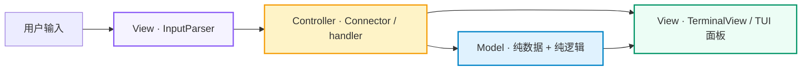
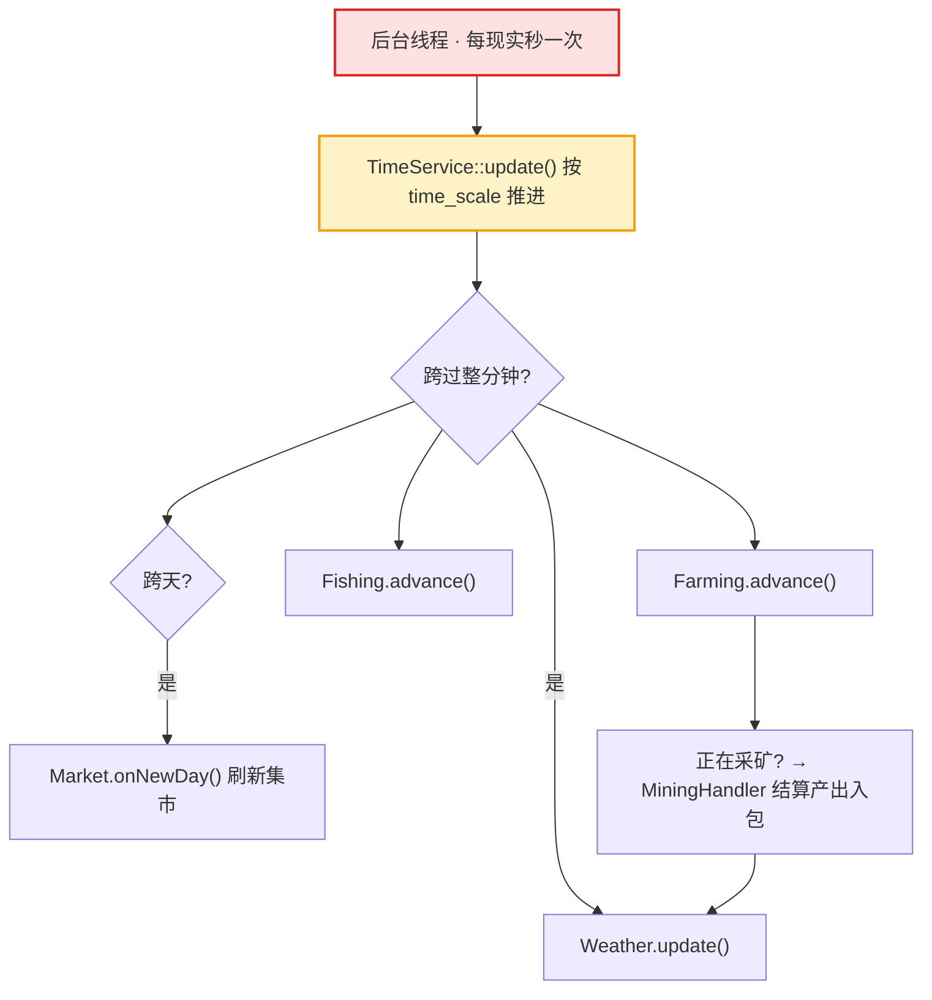

<a id="top"></a>

<div align="center">
  <h1>🥕 Carrot Valley · 胡萝卜山谷</h1>
</div>

<div align="center">

[](CMakeLists.txt)&#160;
[](#%EF%B8%8F-技术架构)&#160;
[](main.cpp)&#160;
[](#%EF%B8%8F-技术架构)&#160;
[](src/View)&#160;
[](tests)

</div>

**一款基于 MVC 架构、由真实时间驱动世界推进的终端（TUI）MUD 游戏。**

<div align="center">

[快速开始](#-快速开始) ｜ [技术架构](#%EF%B8%8F-技术架构) ｜ [子系统](#-子系统与玩法) ｜ [命令参考](#-命令参考) ｜ [项目结构](#-项目结构) ｜ [开发规范](#-开发规范)

</div>

---

## 📖 这是什么

**Carrot Valley（胡萝卜山谷）** 是一个运行在终端里的多人在线文字冒险（MUD）游戏的单机实现。游戏世界里，时间由**真实时钟后台自动推进**——你无需手动 `tick`，作物在生长、鱼在游动、集市在开市、矿脉在小镇夜色中刷新，一切都随游戏时间逐分钟演化。

与传统命令行游戏不同，本项目严格遵循 **Model-View-Controller（MVC）** 架构：`Model` 层只做纯数据与纯逻辑、不感知任何 UI；`View` 层只做纯渲染、通过 DTO 参数接收数据；`Controller` 层以装配方式连接二者，并借助 **FTXUI** 提供带日志区、输入框、动态命令补全和自动参数提示的现代终端界面。

你的角色可以在五个地点之间移动：**🏠 小屋**（起点）→ **🌾 农田** → **🏖️ 海岸** → **⛰️ 矿洞** → **🏘️ 小镇**（集市所在），移动受当日天气制约。

---

## ✨ 特性一览

<table>
<tr>
<td align="center" width="25%">⏱️<br/><b>真实时间推进</b><br/><sub>后台线程按 time_scale 自动推进，世界逐分钟演化</sub></td>
<td align="center" width="25%">🌾<br/><b>复合种田</b><br/><sub>5 种作物 + 2 种肥料，生长周期与等级解锁</sub></td>
<td align="center" width="25%">🎣<br/><b>概率钓鱼</b><br/><sub>5 种鱼按权重随机上钩，消耗饱食度</sub></td>
<td align="center" width="25%">⛏️<br/><b>多层采矿</b><br/><sub>JSON 驱动矿脉/刷新/概率，随矿物结算产出</sub></td>
</tr>
<tr>
<td align="center">🏪<br/><b>波动集市</b><br/><sub>繁荣日/节日 + 动态行情，买卖价格实时浮动</sub></td>
<td align="center">🌦️<br/><b>天气事件</b><br/><sub>影响外出/钓鱼/采矿/浇水，随机事件叠加</sub></td>
<td align="center">🔧<br/><b>工具养护</b><br/><sub>锄头/鱼竿/矿镐，耐久损耗 + 铁匠铺修复</sub></td>
<td align="center">🗂️<br/><b>稳健存档</b><br/><sub>安全解析 + 时间重建，损坏文件可防御</sub></td>
</tr>
</table>

TUI 提供**命令自动补全**、**逐参数交互提示**，并内建 **GoogleTest 单测体系**（`cmdparser_*_test`、`timeservice_*_test`、`mining_*_test`、`view_panel_test` 等 14+ 模块）。

---

## 📢 近况

- **2026-09-15** 🔧 静态链接运行时；批量修复 57 条 Critical/High 缺陷并补齐测试（详见 `docs/bug-fix-report.md`）。
- **2026-09-13** 🎨 修复 TUI 初始焦点，命令可直接输入；完成 `MarketController` 集市流程下沉与命令行参数校验助手。
- **2026-09-08** 🚀 重构输入系统，全量修复 12 项缺陷并补齐测试（27/27 全绿），新增铁匠铺与存档功能。
- **2026-09-07** ☀️ 补全天气/随机事件系统并适配新时间引擎。

---

## 🧠 理解本项目（How It Works）

### 分层数据流



- **Model**（`src/model/*`）：玩家属性、背包、农田、时间、天气、事件等，只存数据、只算逻辑，不做 IO、不输出到屏幕。
- **View**（`src/view/*`）：纯渲染。每个面板（时间/天气/农田/鱼池/集市/采矿/工具/铁匠铺/角色等）以 DTO 为入参，不做业务判断。
- **Controller**（`src/controller/*`）：协调动作。通过**构造函数注入**引用其他子系统，把 `Model` 的最新状态装配成 DTO 交给 `View`。

> `main.cpp` 是组合根（composition root）：逐一 `new` 出子系统并用构造注入串联，再绑定命令处理器；`docs/MvcGuideline.md` 是架构权威文档。

### 世界推进（主要差异点）



真实世界每秒触发一次推进：改写游戏时钟 → 联动天气/作物/钓鱼 → 跨天时刷新集市 → 若在采矿则按到期进度结算。所有对共享世界的读写由 `worldMutex` 与 REPL 命令互斥，避免数据竞争。

---

## ⚙️ 技术架构

采用**双层构建体系**：

| 层级 | 组成 | 说明 |
|:---|:---|:---|
| **独立库** | `time_service`、`model_objects`、`bag`、`map`、`playerstates`、`food`、`crop`、`fertilizer`、`farm`、`game`、`mining_controller`、`player`、`player_serializer`、`tool_controller`、`weather_controller`、`audio`、视图库、`cmd_parser` | 每个模块一个 CMake target，`src/CMakeLists.txt` 聚合 |
| **Jerry 模块** | `Food`、`Crop`、`Fertilizer`、`Farm`、`Fish`、`Farming`、`Fishing`、`Market` | 直接编译进 `MudGame` 可执行文件（`JERRY_SOURCES`） |

**技术栈**

| 类别 | 选型 |
|:---|:---|
| 语言 / 标准 | C++20（`MSVC` 主、`MinGW` 备选，均静态链接运行时） |
| 构建 | CMake ≥ 4.0 |
| 终端界面 | FTXUI v7.0.3（日志区 / 输入框 / 补全 / 提示行） |
| JSON | pjh_json（矿石 / 矿区 / 刷新数据） |
| 命令行 | CLI11 |
| 单元测试 | GoogleTest v1.15.2（`FetchContent`） |
| 音频 | Windows `winmm` MCI 循环背景音乐 |

---

## 🎮 子系统与玩法

| 子系统 | Model | Controller | 玩法要点 |
|:---|:---|:---|:---|
| 时间 | `TimeService` | 后台线程 | 昼夜/天数/倍速，`time_scale` 可调（0.5–600） |
| 玩家 | `Player` | — | 饱食度、金币、种植/钓鱼/采矿三套经验 |
| 种菜 | `Farm` | `FarmingController` | 播种/浇水/施肥/收割，等级解锁作物 |
| 钓鱼 | `Fish` | `FishingController` | 抛竿之后每 3–6 秒按权重出鱼 |
| 采矿 | `MiningSession` | `MiningController` | 0–4 层矿脉，等级/照明门槛，后台结算 |
| 集市 | `Market` / `Shop` | `MarketController` | 种子店/杂货铺/铁匠铺，繁荣日行情波动 |
| 工具 | `Tool` | `tool_controller` | 耐久损耗，可金币/矿石修复升级 |
| 天气 | `Weather` | `weather_controller` | 影响外出/钓鱼/采矿加成/自动浇水 + 随机事件 |
| 存档 | — | `PlayerSerializer` | `save/load`，安全解析 + 时间重建 |

---

## 🕹️ 命令参考

输入行动名称后，TUI 会逐个提示所需参数（支持 Tab 补全）：

```text
time.now / time.scale    查看时间 / 设置倍率(0.5~600)
player.status            查看角色状态
move.up|down|left|right  移动（受天气限制）
farm.status              农田概况
farm.sow <plot> <crop>   播种(白菜/胡萝卜/番茄/南瓜/灵芝)
farm.water <plot>        浇水       farm.fertilize <plot> <type>  施肥
farm.harvest <plot>      收割
fish.status / fish.tick  查看鱼池 / 开始钓鱼（q 结束）
weather.now              查看天气
mine.status|start|stop   采矿状态 / 开始(层0-4) / 结束
market.status|buy|sell   集市行情 / 购物 / 出售
tools.status             工具耐久
blacksmith.status|repair 铁匠铺信息 / 修复工具(矿石或金币)
save / load / help / quit  存档 / 读档 / 帮助 / 退出
```

---

## 📁 项目结构

```text
MudGame/
├── main.cpp                 # 组合根 / 游戏循环（Windows 专用）
├── CMakeLists.txt           # C++20 构建、依赖(FetchContent)、可执行目标
├── AGENTS.md                # 构建/架构/约定速查卡
├── docs/
│   ├── MvcGuideline.md      # 架构权威文档（必读）
│   └── *.md                 # 缺陷报告 / 交接文档 / 规划
├── src/
│   ├── Controller/          # 子控制器 + 业务逻辑
│   │   ├── Game/            # 主游戏控制器（lib `game`）
│   │   ├── GameSession/     # 命令目录 / TUI 控制器 / 世界引擎
│   │   ├── Farming/ Fishing/ Market/ Crop/ Farm/ Fertilizer/ Food/ Fish/
│   │   │                     # Jerry 模块（编译进可执行文件）
│   │   ├── Mining_controller/  # 采矿系统（lib）
│   │   ├── Player/ Tool/ Weather/
│   ├── Model/               # 纯数据 + 纯逻辑（libs）
│   │   ├── Bag/ Map/ Objects/ Playerstates/ Timeservice/
│   ├── View/                # view_primitives / panels / TUI / cmd_parser
│   │   ├── Tui/             # FTXUI 界面（GameTui/TuiRenderer/TuiState）
│   │   └── Panels/          # 各业务面板（Farm/Fish/Market/Mine/...）
│   ├── Audio/               # winmm 循环背景音乐（lib `audio`）
│   ├── Tool/                # 存档序列化（lib `player_serializer`）
│   └── Data/Ore/            # ore.json / mining_layers.json / spawn_rates.json
├── tests/                   # GoogleTest 单测（14+ 模块）
├── res/                     # 运行资源（bgm 等）
└── README.md
```

> `graphify-out/`、`cmake-build-*/`、`thirdparty/`、`.vscode/` 等本地产物与构建输出已在 `.gitignore` 中排除，不纳入版本控制。

---

## 🚀 快速开始

### 1. 前置条件

- Windows（MSVC 或 MinGW）× CMake ≥ 4.0
- 如需构建时自动拉取依赖，保持网络可达 GitHub / Gitee（FTXUI 镜像）。

### 2. 构建

```bash
cmake -B cmake-build-debug -S .
cmake --build cmake-build-debug
```

### 3. 运行

```bash
./cmake-build-debug/MudGame.exe
```

程序自动定位 `res/` 下的背景音乐，进入指令式 TUI 界面，输入 `help` 查看全部指令，`quit` 退出。

### 4. 测试

```bash
cd cmake-build-debug && ctest --output-on-failure
```

单跑某个模块（按测试目标名过滤）：

```bash
ctest -R mining_core_flow_test --output-on-failure
```

---

## 📐 开发规范

1. **MVC 架构**：严格遵循 `docs/MvcGuideline.md`，依赖方向恒为 `Controller → Model` 与 `Controller → View`，`Model`/`View` 单向被动。
2. **控制器注入**：别人通过 `Controller` 使用你的系统；需要引用其他系统时使用**构造函数注入**。
3. **访问控制**：务必做好公有/私有区分，接口留在公有的 `.h`。
4. **目录约定**：每个 component 用 `include/` 放头文件、`src/` 放 cpp。
5. **命名双轨**：新模块（Timeservice / Mining_controller / Weather / Tool / Cmdparser）用 `mud::` 命名空间 + snake_case；旧 Model 模块（Player / Bag / Object / Position / Map）用全局命名空间 + PascalCase——跟随所改模块既有风格，同一模块内不混搭。
6. **改动纪律**：改动经 graphify 检查依赖与调用链；每次操作提交 git 便于回滚。

### 开发流程

1. 认领系统 → 2. 在 Controller 完成接口（`.h` 声明）→ 3. 开发实现。

---

## 🤝 贡献

欢迎以以下形式参与：

- 🐛 Bug 报告与回归用例（测试目标命名：`<module>_*_test`）
- 🎨 新面板 / 新子系统（遵循 MVC + 构造注入）
- 📝 文档补充

📧 项目仓库：[github.com/CarrotMissileVehicle/MudGame](https://github.com/CarrotMissileVehicle/MudGame)

<p align="right"><a href="#top">🔝回到顶部</a></p>